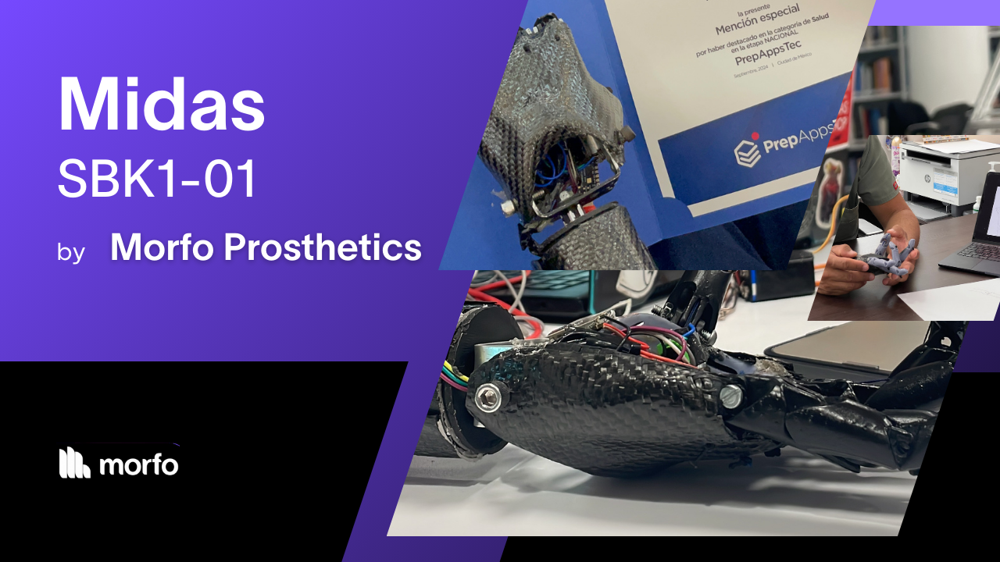
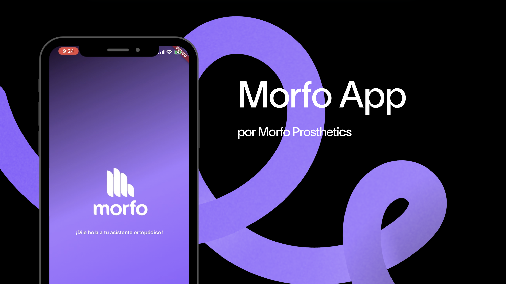

# About Morfo...
We are a Mexican bionic prosthetic startup that aims to empower those who have suffered the loss of an upper limb, and give them access to an accessible, inclusive, functional device to dignifiedly engage and/or rehabilitate in a society that has labeled them as  *handicapped* .

# Midas

Midas is our transradial, modular, fiber carbon based prosthetic that allows our users to:

* Carry objects up to 4kg.
* Contract and extend finger articulations precisely.
* Rotate and deattach the wrist smoothly.

## Midas Prosthetic Arm Documentation

Below you'll find detailed information divided into several sections.

- [Overview and Construction](./docs/midas-overview.md)
- [Electronics and Signal Processing](./docs/midas-electronics.md)
- [Communication Protocol](.docs/midas-comprotocol.md)
- [Key Features](./docs/midas-features.md)
- [Future Developments](./docs/midas-future.md)

# Morfo-App
> Built to have no limits.

## Main Objective
The app is designed to support patients in their rehabilitation process. By strengthening brain-muscle coordination, our users enhance control over the prosthesis we developed, equipped with electromyographic sensors.

<h1 style="color: purple">Key Features</h1>

### Real Time Telemetry
The app displays real-time graphs showing critical electromyographic detection points across different muscle groups, including:

  * 📊 Maximum and minimum values.
  * 💪🏼 Muscle constants.

This information, analyzed with the help of a rehabilitation professional, helps improve the precision in using Midas.  Additionally, the app provides a **summary of previous readings** to track learning progress and share it with specialists.

### Technical Data
Users have access to key technical information, including:

  * 🛜 WiFi connectivity status.
  * 🔋 Battery level.
  *  👓 Sensor quality of electromiographic system.

### Support and resources
Within the app, we offer a dedicated section that includes:

  * ℹ️ Information about Morfo.
  * 👩🏽‍⚕️ A directory of **certified specialists** who work with us to provide comprehensive rehabilitation.
  * 💬 Key technical information on the prosthesis, amputation processes, and access to certified rehabilitation professionals, clinicians, and surgeons.

## Future Development

### Gamified Telemetry
We are working on implementing interactive games, such as “touch games,” aimed at improving brain-muscle coordination in a fun and effective way.

### Educational Tools for youth rehabilitants
Our future plans include creating educational material aimed at the children’s sector, where kids can develop simple algorithms to control their prosthesis and familiarize themselves with the device from an early age.

