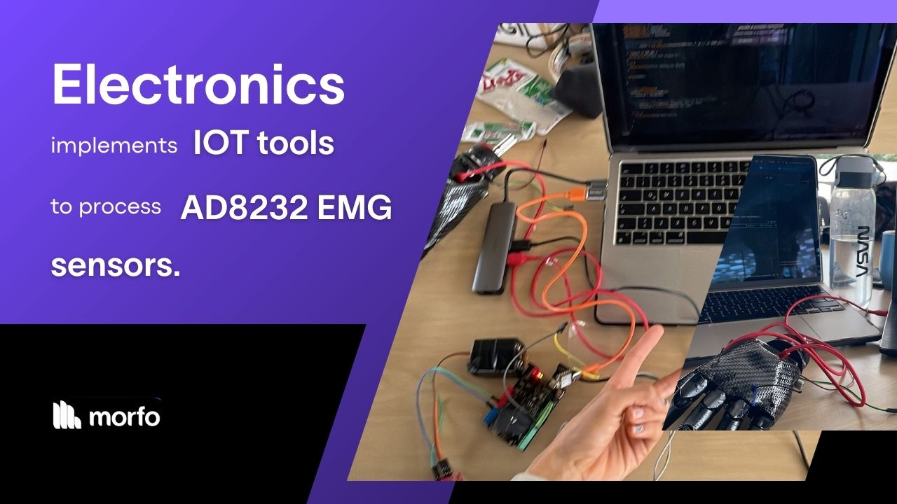

# Communication protocol

After filtering, the XIAO ESP32 sends the processed signals to two separate destinations:

* 🛜 **Wifi Communication:** Midas transmits data via Wi-Fi to the Morfo App, which communicates with our Real-Time Database. This allows the app to display **real-time telemetry data**, providing feedback to the user and their healthcare provider about the prosthetic’s performance.

* 🖐🏻 **Control of finger movement:** The signals are also sent to the second controller, located in the hand section of the prosthetic. This board directly controls the servomotors responsible for moving each finger, allowing precise contraction and extension movements based on the user's muscle input.
  
[Next: Key Features 🦾](./midas-features.md)
