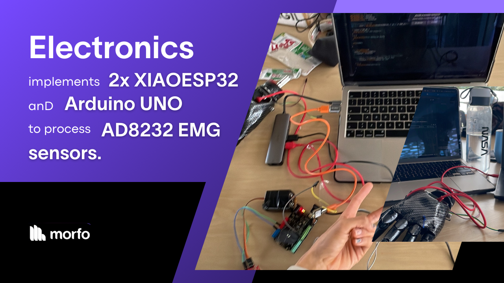

# Midas Prosthetic Arm – Electronics and Signal Processing

## Components
The Midas prosthetic arm operates through an advanced combination of **microcontrollers** and **sensors**. The system’s core consists of three boards in charge of processing analog signals from the **electromyographic sensor**, which captures muscle activity from the user’s forearm.

## Process

### Analog signal interpretation
The core board is responsible for processing analog signals received from the AD8232 electromyographic sensor. This sensor captures muscle activity from the user’s forearm, converting the biological signals into data that the prosthetic can interpret.

###  Analog signal Filtering
These signals are then passed on to the arm processing board. This microcontroller applies a secondary filtering process to the signals, analyzing their intensity and duration to determine the user’s intent.

[Next: Comm protocol 🛜](./midas-comprotocol.md)
