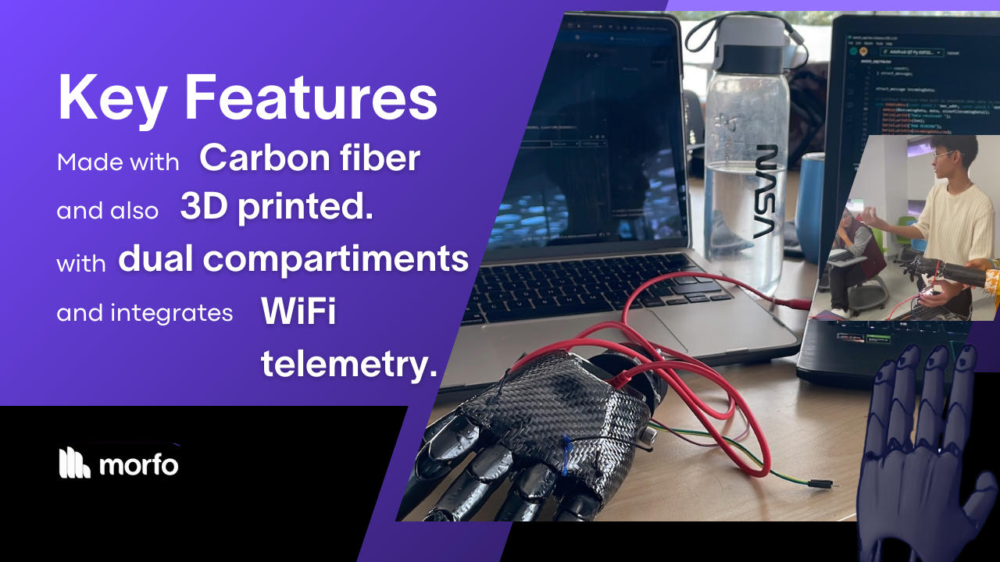

# Midas Prosthetic Arm - Key Features

🦾 **Carbon Fiber Construction:** Lightweight yet durable, ensuring structural integrity and user comfort.

🖨️ **3D-Printed Components:** Custom-designed fist and fingers with an ergonomic fit.

💥 **Electromyographic Sensor (AD8232):** Enables muscle-based control of the prosthetic.

✨**Dual Compartment Design:** Allows easy access to internal electronics.

🛜**Wi-Fi Enabled Telemetry:** Connects to the Morfo app for real-time data monitoring and patient feedback.

🖐🏻**Precise Finger Movement:** Controlled by servomotors, allowing accurate and responsive control.

[Next: Midas' Future 🔜](./midas-future.md)
