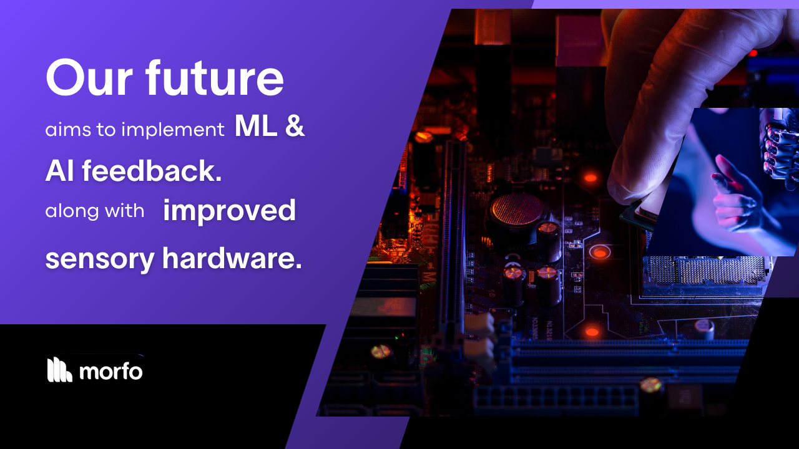

# Midas Prosthetic Arm - Future Development

Midas has the potential for further enhancements, including:

* **Improved Sensory Feedback:** Integration of haptic sensors to provide tactile feedback to the user.
* **Machine Learning:** Implementing learning algorithms to adjust the prosthetic’s responses based on the user’s unique muscle patterns.
