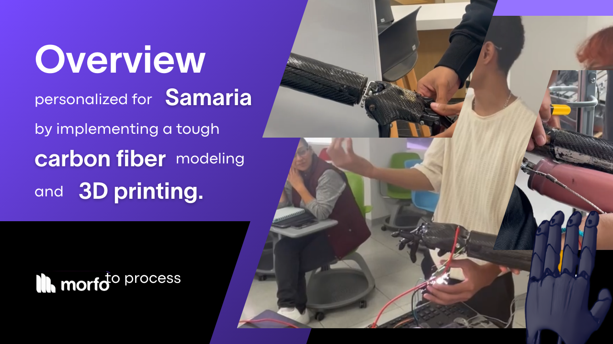

# Overview

**Midas** is a transradial prosthetic made from **carbon** fiber, designed for enhanced durability, precision, and ease of use. This is the third version of Midas, originally created as a customized prototype for *Samaria Méndez*, a high school student at Prepa Tec Campus Puebla. The prosthetic was tailored to her needs through a combination of 3D printing and carbon fiber molding.

## Construction Details
The prosthetic features a **3D-printed fist and fingers** in a standard size, covered with a layer of carbon fiber for durability. The arm is designed with **two compartments**, controlled by **servomotors**, which allow easy access to the internal electronics.

[Next: Electronics 🔋](./midas-electronics.md)
